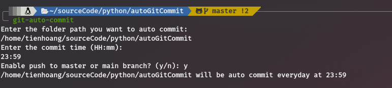

# Auto Git Commit

---
**Features**:
- Easy setup cronjob for auto commit on "in progress" task
- Just like that, you expected more?

**Requirements**:
- pip & python >= 3.6 

**Install**

```bash
$ bash <(curl -s https://raw.githubusercontent.com/hoangthanhtien/git-auto-commit/master/install.sh)
```

**Usage**
1. Copy the git folder path of the git repo you want to auto commit
2. Run bellow command and just do what it say
```bash
$ git-auto-commit
```

3. (Optional) Check the crontab

```bash
crontab -e
```